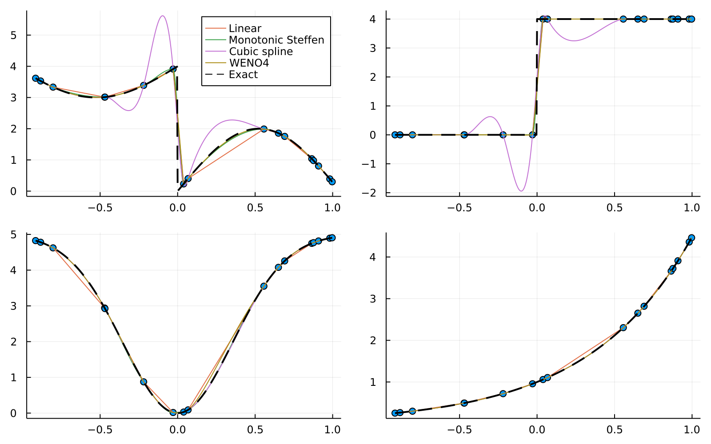

[](https://github.com/tiagopereira/WENO4.jl/actions/workflows/CI.yml?query=branch%3Amain)
[](https://codecov.io/gh/tiagopereira/WENO4.jl)


# WENO4.jl

A package to perform interpolation using the 4th order Weighted Essentially Non-Oscillatory (WENO) scheme of [Janett et al (2019)](https://ui.adsabs.harvard.edu/abs/2019A%26A...624A.104J/abstract). Based on [Weno4Interpolation](https://github.com/Goobley/Weno4Interpolation) by Chris Osborne.


## Installation

From the Julia REPL:

```julia
using Pkg
Pkg.add("WENO4")
```


## Example Usage

Create a grid `xp` and an array `fp` of values to be interpolated
```julia
xp = 1:0.2:5
f(x) = log(x)
fp = f.(xp)
```
Interpolate to a new set of points `xs`:
```julia
xs = [1.1, 2.1, 3.1, 4.1]
result = interpolate_weno4(xs, xp, fp)
```

## Example results

The following comparison shows how WENO4 performs compared with linear and Monotonic interpolation (from [Interpolations.jl](https://github.com/JuliaMath/Interpolations.jl)) and a cubic spline (from [Dierckx.jl](https://github.com/kbarbary/Dierckx.jl)) for different functions randomly sampled at 17 points.



## Performance

WENO4's performance is very competitive, especially for irregular grids where it performs in many cases as fast as linear interpolation from Interpolations.jl. The following table shows some benchmarks comparing the median times of different interpolation methods for different numbers of randomly-spaced input nodes (`Npoints`) and equidistant points to interpolate (`Ninterp`):

| `Npoints` | `Ninterp` | Linear | WENO4 | Monotonic | Cubic spline |
|----:|----:|----:|----:|----:|----:|
| 10 | 10 | 0.21 | 0.09 | 0.18 | 0.69 |
| 10 | 100 | 0.44 | 0.55 | 0.67 | 1.54 |
| 100 | 100 | 1.00 | 1.06 | 1.42 | 4.35 |
| 100 | 10000 | 76.96 | 68.43 | 93.52 | 122.74 |
| 500 | 500 | 4.50 | 7.43 | 10.90 | 26.41 |
| 500 | 10000 | 83.60 | 90.00 | 121.49 | 141.00 |

The times were normalised to the linear interpolation times for the case of `(Npoints=100, Ninterp=100)`. Linear interpolation was performed using Interpolations.jl. Monotonic interpolation was performed using Interpolations.jl, using `SteffenMonotonicInterpolation`. Cubic spline interpolation was performed using Dierckx.jl. All timings include the creation of an interpolant and performing the interpolation at the required points. 